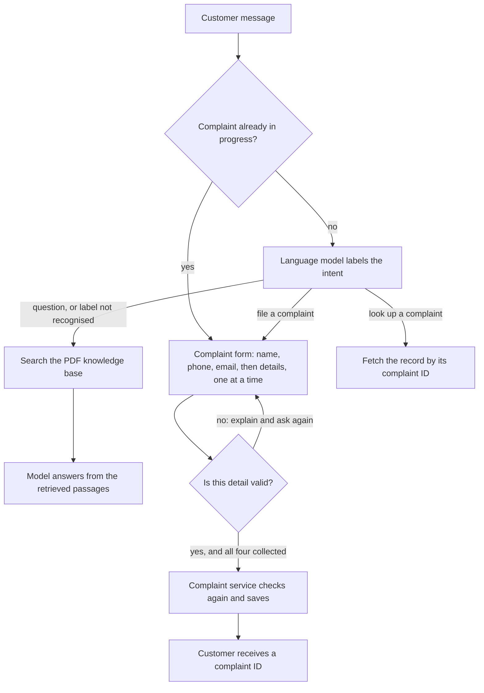
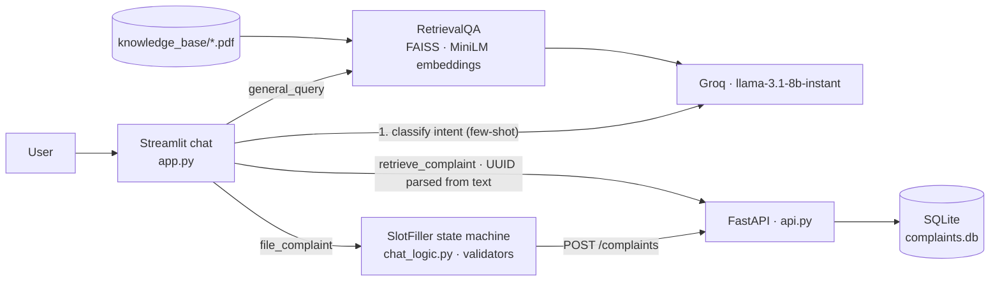

# Customer Service RAG Chatbot

**A support chatbot that answers policy questions from a PDF knowledge base with retrieval-augmented generation, and files and retrieves customer complaints through a validated slot-filling flow backed by a FastAPI service.**

  [](https://github.com/gandhiashutosh14/customer-service-rag-chatbot/actions/workflows/ci.yml) 


---

> **In plain English:** Support teams want a chatbot that answers customers from the company's own documents and can log complaints, without inventing policies or saving bad records. This repository answers questions from PDF files and hands complaint-taking to ordinary, tested code that checks every detail before a record is saved. It is a working prototype: 21 tests cover the complaint flow and service, but live model conversations and the Docker image are unverified ([Status and scope](#status-and-scope), [Quick start](#quick-start)).
>
> **Reading guide:** business readers can read the next three sections, then jump to [SWOT](#swot-analysis) and [where this applies](#where-this-applies). Engineers can go straight to [What it is, and why](#what-it-is-and-why).

## The problem in plain English

A customer writes: "The parcel arrived four days late and the box was damaged." (The message is taken from [`tests/test_chat_logic.py`](tests/test_chat_logic.py).) A good support agent does two things. First, they check company policy before promising anything. Second, they take the customer's name, phone number and email address, check each one, and give back a reference number.

A chatbot built on a large language model (LLM) is fluent, but on its own it is unreliable at both jobs. Asked about policy, it can give a confident answer that no company document supports; this is called a hallucination. Asked to register a complaint, it may accept a phone number with digits missing, skip the email address, or save a half-finished record. Each mistake reaches a real customer or a real database.

<p align="center"></p>
<p align="center"><sub>Image: <a href="https://commons.wikimedia.org/wiki/File:Callcentre.jpg">Callcentre.jpg</a> by Petiatil, public domain, via Wikimedia Commons.</sub></p>

Two techniques address this. Retrieval-augmented generation (RAG) first finds the most relevant passages in the company's own documents, then asks the model to answer from them. It reduces invented answers but does not remove them, and this repository has no test set that measures answer quality. For complaints, ordinary code runs the conversation: it asks for each detail in turn, checks it, and saves the record only when everything is valid. The model's only job there is to recognise what the customer wants.

The sample knowledge base is a short FAQ (frequently asked questions) document on complaint handling ([`knowledge_base/sample_faq.pdf`](knowledge_base/sample_faq.pdf)). A real deployment would load the company's own policy documents instead.

## Executive summary

| Question | Answer |
|---|---|
| What problem does this address? | Support chat that must answer from the company's own documents and must record complaints accurately. |
| Who has this problem? | Heads of customer service and contact centres, e-commerce and retail operations teams, and anyone building a support chatbot for an organisation that handles complaints. |
| What does this repository do? | A chat app answers questions from PDF files using RAG. When a customer wants to complain, it switches to a step-by-step form that checks the name, phone number and email address, then saves the complaint through a small web service that returns a complaint ID. |
| What has been shown so far? | 21 automated tests pass: 13 for the conversation logic and 8 for the complaint service ([Project layout](#project-layout)). A manual check of the service with curl, a command-line web client, returned 201 for a new complaint, 200 for a lookup, 404 for an unknown ID and 422 for invalid input ([Try it](#try-it)). |
| How mature is it? | Working prototype. The complaint flow and the service are tested. The chat screen was checked only to the point where it renders, without a model key ([Status and scope](#status-and-scope)). |
| What it is not | Not measured for answer quality (there is no evaluation set), not verified in a live conversation with the hosted model, and not a trained intent classifier. The Docker image is untested ([Quick start](#quick-start)). |
| What it would take to use it for real | Load real policy documents and build a question-and-answer test set; run and review live conversations; add authentication, rate limits and data-protection controls for personal details; move complaints to a managed database; build and scan the container image. |

## How it works, end to end



This is the business view; [Architecture](#architecture) below shows the components.

1. **Load the documents.** When the chat app starts ([`app.py`](app.py)), it reads every PDF in `knowledge_base/` and splits the text into overlapping chunks of 1,000 characters. Each chunk becomes an embedding from `all-MiniLM-L6-v2` and goes into a FAISS index, a fast similarity-search store.
2. **Work out what the customer wants.** Unless a complaint is in progress, a Groq-hosted Llama model labels the message as a question, a new complaint or a complaint lookup. Its prompt includes a few examples, one of them in Hinglish (Hindi written in Latin letters and mixed with English).
3. **Treat the label with suspicion.** [`chat_logic.py`](chat_logic.py) accepts only an exact, known label. Anything else, including a failed model call, counts as a general question. An unexpected reply therefore leads to a document answer, not an action.
4. **Answer questions from the documents.** For a general question, the app retrieves the 5 closest chunks and passes them to the model with the question (LangChain `RetrievalQA` in [`app.py`](app.py)). The library's default prompt for this step tells the model to say it does not know rather than make up an answer.
5. **Collect a complaint step by step.** `SlotFiller` in [`chat_logic.py`](chat_logic.py) asks for the name, phone number, email address and details in turn. Each answer is checked at once; an invalid one gets a specific error and the same question again.
6. **Save through a validated service.** Once all four details are valid, the app posts them to the FastAPI service in [`api.py`](api.py). The service checks them again with Pydantic, stores them in SQLite and returns a unique complaint ID.
7. **Look complaints up and handle interruptions.** A message containing a complaint ID fetches that record, and an unknown ID gets a "not found" reply. If a customer quotes an ID while filing a new complaint, the bot asks before abandoning it. A cancel button stays visible while a complaint is in progress.

**Worked example.** The exchange below pairs the sample message from [Try it](#try-it) with inputs from two tests in [`tests/test_chat_logic.py`](tests/test_chat_logic.py), using the bot's exact wording from [`chat_logic.py`](chat_logic.py). The tests supply the issue summary, "a late delivery", directly; in the app the model writes it. No live model call is shown.

| Customer types | Bot replies |
|---|---|
| `I want to file a complaint about a late delivery` | "I'm sorry to hear about a late delivery. Please provide your name." |
| `my order is late` (a complaint typed where the name should go) | "The name you provided isn't valid. Please enter your full name (letters and spaces only)." |
| `Priya Sharma` | "Thank you, Priya Sharma. What is your phone number?" |
| `123` (too few digits) | "Invalid phone number: '123'. Please enter a valid 10-15 digit phone (optional '+' prefix)." |
| `9876543210`, then `priya@example.com`, then the details | "Got it. Please provide your email address.", then "Thanks. Can you share more details about a late delivery?", then the form is complete. |

The app then sends the four details to `POST /complaints` and passes the new complaint ID back to the customer. The manual curl check under [Try it](#try-it) shows the service answering `201` with such an ID.

---

## What it is, and why

Most "chat with your PDF" demos stop at question answering. Support conversations also need to *do* things: take a complaint, validate the contact details, hand back a ticket ID, and look the ticket up later. This project combines both in one chat surface:

- **Ask a question** and the answer is grounded in the PDFs under `knowledge_base/` via FAISS retrieval and a Groq-hosted Llama model.
- **Say "I want to file a complaint"** and the bot switches into a deterministic slot-filling flow: name, phone, email, details, each validated immediately, then `POST /complaints` returns a UUID.
- **Say "show complaint <id>"** and it fetches the record from the API and renders it.

An LLM decides the *intent*; plain Python decides everything after that. That split is deliberate: the parts that must be correct (validation, state, API calls) are testable and never hallucinate.

## Architecture



## Key features

- **Grounded answers**: PDFs are chunked (1000 chars, 200 overlap), embedded with `all-MiniLM-L6-v2`, indexed in FAISS, and the top 5 chunks are stuffed into the prompt. The index is built once per process with `st.cache_resource`.
- **Few-shot intent routing** across `file_complaint`, `retrieve_complaint` and `general_query`, including a Hinglish example, with a safe fallback to RAG when the model's reply is not a known label.
- **Slot filling as a state machine** (`SlotFiller` in `chat_logic.py`): validates names, 10-15 digit phone numbers and email addresses, rejects names that look like complaint text, re-asks on failure, and exposes the payload only when complete.
- **Interrupt handling**: quoting a complaint ID mid-flow asks whether to abandon the current complaint; a cancel button is always visible while one is in progress.
- **Complaint service** with Pydantic v2 validation (`422` on bad input), UUID IDs, ISO-8601 UTC timestamps, `404` on unknown IDs, and a configurable database path so tests run against a temp file.

## Tech stack

Python 3.11 · Streamlit · FastAPI · SQLite · LangChain 0.3 (`RetrievalQA`, `PyPDFLoader`) · FAISS · `sentence-transformers/all-MiniLM-L6-v2` · Groq (`llama-3.1-8b-instant`) · pytest.

## AI engineering highlights

1. **Keep the LLM out of the parts that must not fail.** The model classifies intent and answers open questions. Field validation, conversation state and the API contract are ordinary code with 21 unit tests. A hallucinated phone number cannot reach the database.
2. **Intent output is normalised, not trusted.** The classifier is asked to reply with a bare label; the first line of its reply is lower-cased and checked against the allowed set, and anything else routes to RAG. The tests pin that behaviour, including the case where the model echoes `Intent:`.
3. **Testable API without touching real data.** The SQLite path is read from `COMPLAINTS_DB_PATH`, the connection is opened lazily, and the test fixture imports the app against a temporary file, so the suite runs in CI with no fixtures on disk.
4. **Graceful degradation.** Every model call is wrapped: a failed intent call falls back to `general_query`, a failed brief extraction falls back to "your issue", and API errors are shown in chat rather than crashing the session.

## Quick start

```bash
git clone https://github.com/gandhiashutosh14/customer-service-rag-chatbot.git
cd customer-service-rag-chatbot
python -m venv .venv
# Windows: .venv\Scripts\activate    macOS/Linux: source .venv/bin/activate
pip install -r requirements-dev.txt          # pulls torch for the embedding model
cp .env.example .env                          # then put your Groq key in GROQ_API_KEY

pytest -q                                     # 21 passed

uvicorn api:app --port 8000                   # terminal 1: complaint service
streamlit run app.py                          # terminal 2: chat UI at http://localhost:8501
```

`scripts/start.sh` runs both processes together, and the `Dockerfile` packages them (not built yet; see the development notes).

### Try it

- *"What is your refund policy?"* answers from `knowledge_base/sample_faq.pdf`.
- *"I want to file a complaint about a late delivery"* starts the flow; try an invalid phone number to see validation.
- *"Show details for complaint 62c14e4e-5890-4f83-b15b-abb9c6aa6170"* retrieves a record.

The API alone, verified with curl on 2026-09-16:

```
POST /complaints  {name, phone_number, email, complaint_details}
  -> 201 {"complaint_id": "62c14e4e-5890-4f83-b15b-abb9c6aa6170", "message": "Complaint created successfully"}
GET  /complaints/62c14e4e-5890-4f83-b15b-abb9c6aa6170
  -> 200 {..., "created_at": "2026-09-16T12:42:10.520858+00:00"}
GET  /complaints/nope                      -> 404
POST /complaints  (bad phone/email/blank)  -> 422
```

## Project layout

```
app.py              Streamlit UI, LLM calls, RAG chain, API client
chat_logic.py       validators, UUID parsing, prompt builders, SlotFiller (no Streamlit, no LLM)
api.py              FastAPI complaint service over SQLite
knowledge_base/     PDFs indexed at startup (sample FAQ included)
tests/              test_chat_logic.py (13) · test_api.py (8)
scripts/start.sh    run API + UI together
Dockerfile          both services in one image
docs/               screenshot, development notes
```

## Status and scope

Working prototype.

- The knowledge base is a sample FAQ. Retrieval quality on your own documents depends on chunking and on the 8B model; there is no evaluation set.
- Intent classification uses a few-shot prompt, not a trained classifier; unusual phrasings fall through to RAG.
- Chat state is per browser session; complaints persist in SQLite but conversations do not.
- The Streamlit UI was exercised during the refinement only up to rendering (no Groq key was used); the API and the state machine were verified end to end.

## SWOT analysis

A SWOT analysis lists **S**trengths and **W**eaknesses (inside the project) and **O**pportunities and **T**hreats (outside it).

| | Helpful | Harmful |
|---|---|---|
| **Internal** | **Strengths**<br>• The model only picks the intent; validation, conversation state and saving are ordinary, tested code<br>• Details are checked twice: in the chat form ([`chat_logic.py`](chat_logic.py)) and again by the service ([`api.py`](api.py))<br>• An unrecognised model reply falls back to a document answer, never to an action<br>• The 21 tests run in CI (continuous integration) without the model, the embedding model or the real database ([`.github/workflows/ci.yml`](.github/workflows/ci.yml))<br>• A small code base with a clear split between chat screen, logic and service | **Weaknesses**<br>• No evaluation set, so answer quality on real documents is unmeasured<br>• No live conversation with the hosted model has been verified, and the Docker image is untested<br>• Intent routing is a few-shot prompt, not a trained classifier; unusual phrasing falls through to document answers<br>• Only PDF files are indexed (the `.docx` file in `knowledge_base/` is skipped), and the index is rebuilt in memory whenever the app process starts<br>• Conversations are not stored, the service has no authentication, and SQLite suits a single machine |
| **External** | **Opportunities**<br>• Most support organisations already hold FAQs and policy documents that could feed retrieval<br>• The same split, where the model routes and code acts, fits returns, bookings and account changes<br>• Showing the source passage next to each answer would make answers easier to check<br>• Customers who mix languages: the intent prompt already includes a Hinglish example | **Threats**<br>• Helpdesk and CRM (customer relationship management) platforms now ship built-in chatbots<br>• Hosted models are renamed and retired, so the default `llama-3.1-8b-instant` may not stay available<br>• Data-protection law applies to the names, phone numbers and email addresses the service stores<br>• Customers can type text designed to manipulate the model, known as prompt injection<br>• A wrong policy answer can create a commitment the business is expected to honour |

## Where this applies

The pattern suits any organisation that answers routine questions from written policies and records customer issues. The rows below are illustrative examples, not deployments.

| Industry | Example use case | What this project's approach contributes |
|---|---|---|
| E-commerce and retail | Late, missing or damaged orders | Answers from the delivery and returns FAQ, plus a complaint form that will not save an invalid phone number or email address |
| Telecoms and internet providers | Outage and billing complaints | A complaint ID that the customer can quote later to retrieve the record |
| Banking and insurance | Card disputes and claim enquiries | Records are written by validated code, not by the model, which is easier to audit |
| Utilities | Billing and meter-reading questions | Answers grounded in tariff and policy PDFs rather than in the model's general knowledge |
| Travel and hospitality | Booking problems and refund requests | A customer can switch from a new complaint to checking an old one, and the bot asks before dropping the new one |
| Public services | Intake of citizen grievances | Structured, validated records instead of free-text chat logs |
| Healthcare administration | Appointment and billing queries, not clinical advice | A clear line between answering from approved documents and collecting contact details |
| Education | Student help desks for fees and admissions | Unclear requests fall back to document answers instead of triggering an action |

## Glossary

| Term | Plain-English meaning |
|---|---|
| LLM (large language model) | A model trained on large amounts of text that can answer questions and follow instructions. |
| Hallucination | A fluent but unsupported or false statement produced by a language model. |
| RAG (retrieval-augmented generation) | Looking up relevant passages in your own documents first, then asking the model to answer from them. |
| Chunk | A short, overlapping slice of a document, small enough to search and to fit into a prompt. |
| Embedding | A list of numbers that captures the meaning of a text, so that similar texts get similar numbers. |
| FAISS | An open-source library that quickly finds the stored embeddings closest to a query. |
| Intent | What the customer wants to do: ask a question, file a complaint or look one up. |
| Few-shot prompt | An instruction to the model that includes a few worked examples of the expected reply. |
| Slot filling | Collecting a fixed set of details, the "slots", one question at a time. |
| State machine | Code that is always at one known step and moves on only when the input is valid. |
| Groq | A cloud service that runs open models such as Llama and returns their replies through an API (application programming interface). |
| FastAPI and Pydantic | Python tools for building web services; Pydantic checks that incoming data has the right fields and formats. |
| UUID (universally unique identifier) | A long, randomly generated identifier, used here as the complaint ID. |
| HTTP status codes | Standard numeric replies from a web service (HTTP is the web's request protocol): 201 means created, 404 not found and 422 invalid data. |

## Further reading

Background on the methods and tools this chatbot builds on.

| Resource | What it is | Why it matters here |
|---|---|---|
| [Retrieval-Augmented Generation for Knowledge-Intensive NLP Tasks](https://arxiv.org/abs/2005.11401) — Lewis et al., 2020 | The research paper that described retrieval-augmented generation: retrieve relevant passages, then generate an answer conditioned on them. | The pattern this chatbot uses to answer from the company's own PDFs. |
| [Lost in the Middle: How Language Models Use Long Contexts](https://arxiv.org/abs/2307.03172) — Liu et al., 2023 | A study finding that models use information at the start or end of a long prompt better than information in the middle. | The chatbot places several retrieved chunks in one prompt, so their number and order can affect answers. |
| [Billion-scale similarity search with GPUs](https://arxiv.org/abs/1702.08734) — Johnson, Douze and Jégou, 2017 | The paper that details the GPU (graphics processing unit) implementation in the FAISS library. | Background on the search technique behind the chatbot's document index. |
| [facebookresearch/faiss](https://github.com/facebookresearch/faiss) — Meta's Fundamental AI Research group, GitHub | The FAISS library for efficient similarity search and clustering of dense vectors. | The index that finds the passages closest to a customer's question. |
| [Sentence-BERT: Sentence Embeddings using Siamese BERT-Networks](https://arxiv.org/abs/1908.10084) — Reimers and Gurevych, 2019 | The method behind the sentence-transformers library, which turns sentences into comparable embeddings. | The chatbot's default embedding model comes from this line of work. |
| [sentence-transformers/all-MiniLM-L6-v2](https://huggingface.co/sentence-transformers/all-MiniLM-L6-v2) — Hugging Face model card | The model card for the small embedding model the chatbot uses by default. | It states the model's intended use and that long inputs are truncated, which limits useful chunk size. |
| [LangChain overview](https://docs.langchain.com/oss/python/langchain/overview) — LangChain documentation | Official documentation for the framework that connects document loaders, text splitters, vector stores and models. | The repo pins LangChain 0.3 in [`requirements.txt`](requirements.txt), and these docs describe a newer major version, so check examples against the pinned one. |
| [Build a basic LLM chat app](https://docs.streamlit.io/develop/tutorials/chat-and-llm-apps/build-conversational-apps) — Streamlit documentation | The official tutorial for chat screens built with `st.chat_message` and `st.chat_input`. | The chat window in `app.py` is built from these two elements. |
| [Request Body](https://fastapi.tiangolo.com/tutorial/body/) — FastAPI documentation | How FastAPI checks incoming request data against a Pydantic model. | The complaint service relies on this to reject bad records with a 422 error. |
| [2025 Top 10 Risk & Mitigations for LLMs and Gen AI Apps](https://genai.owasp.org/llm-top-10/) — OWASP Gen AI Security Project, 2025 | The list of top security risks for LLM applications from OWASP, a non-profit software-security foundation. | Its "Prompt Injection" and "Misinformation" entries describe the main risks a support chatbot faces. |

## License

MIT. See [LICENSE](LICENSE).
