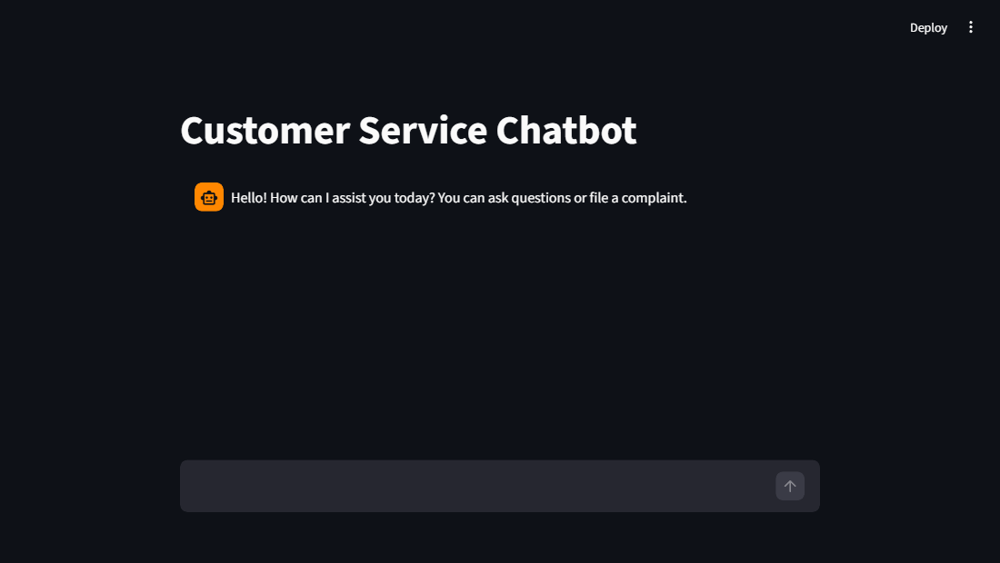
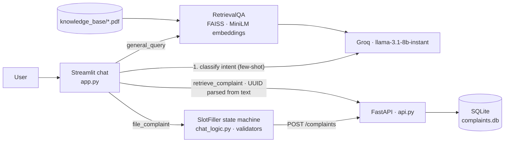

# Customer Service RAG Chatbot

**A support chatbot that answers policy questions from a PDF knowledge base with retrieval-augmented generation, and files and retrieves customer complaints through a validated slot-filling flow backed by a FastAPI service.**

  [](https://github.com/gandhiashutosh14/customer-service-rag-chatbot/actions/workflows/ci.yml) 



---

## What it is, and why

Most "chat with your PDF" demos stop at question answering. Support conversations also need to *do* things: take a complaint, validate the contact details, hand back a ticket ID, and look the ticket up later. This project combines both in one chat surface:

- **Ask a question** and the answer is grounded in the PDFs under `knowledge_base/` via FAISS retrieval and a Groq-hosted Llama model.
- **Say "I want to file a complaint"** and the bot switches into a deterministic slot-filling flow: name, phone, email, details, each validated immediately, then `POST /complaints` returns a UUID.
- **Say "show complaint <id>"** and it fetches the record from the API and renders it.

An LLM decides the *intent*; plain Python decides everything after that. That split is deliberate: the parts that must be correct (validation, state, API calls) are testable and never hallucinate.

## Architecture



## Key features

- **Grounded answers**: PDFs are chunked (1000 chars, 200 overlap), embedded with `all-MiniLM-L6-v2`, indexed in FAISS, and the top 5 chunks are stuffed into the prompt. The index is built once per process with `st.cache_resource`.
- **Few-shot intent routing** across `file_complaint`, `retrieve_complaint` and `general_query`, including a Hinglish example, with a safe fallback to RAG when the model's reply is not a known label.
- **Slot filling as a state machine** (`SlotFiller` in `chat_logic.py`): validates names, 10-15 digit phone numbers and email addresses, rejects names that look like complaint text, re-asks on failure, and exposes the payload only when complete.
- **Interrupt handling**: quoting a complaint ID mid-flow asks whether to abandon the current complaint; a cancel button is always visible while one is in progress.
- **Complaint service** with Pydantic v2 validation (`422` on bad input), UUID IDs, ISO-8601 UTC timestamps, `404` on unknown IDs, and a configurable database path so tests run against a temp file.

## Tech stack

Python 3.11 · Streamlit · FastAPI · SQLite · LangChain 0.3 (`RetrievalQA`, `PyPDFLoader`) · FAISS · `sentence-transformers/all-MiniLM-L6-v2` · Groq (`llama-3.1-8b-instant`) · pytest.

## AI engineering highlights

1. **Keep the LLM out of the parts that must not fail.** The model classifies intent and answers open questions. Field validation, conversation state and the API contract are ordinary code with 21 unit tests. A hallucinated phone number cannot reach the database.
2. **Intent output is normalised, not trusted.** The classifier is asked to reply with a bare label; the first line of its reply is lower-cased and checked against the allowed set, and anything else routes to RAG. The tests pin that behaviour, including the case where the model echoes `Intent:`.
3. **Testable API without touching real data.** The SQLite path is read from `COMPLAINTS_DB_PATH`, the connection is opened lazily, and the test fixture imports the app against a temporary file, so the suite runs in CI with no fixtures on disk.
4. **Graceful degradation.** Every model call is wrapped: a failed intent call falls back to `general_query`, a failed brief extraction falls back to "your issue", and API errors are shown in chat rather than crashing the session.

## Quick start

```bash
git clone https://github.com/gandhiashutosh14/customer-service-rag-chatbot.git
cd customer-service-rag-chatbot
python -m venv .venv
# Windows: .venv\Scripts\activate    macOS/Linux: source .venv/bin/activate
pip install -r requirements-dev.txt          # pulls torch for the embedding model
cp .env.example .env                          # then put your Groq key in GROQ_API_KEY

pytest -q                                     # 21 passed

uvicorn api:app --port 8000                   # terminal 1: complaint service
streamlit run app.py                          # terminal 2: chat UI at http://localhost:8501
```

`scripts/start.sh` runs both processes together, and the `Dockerfile` packages them (not built yet; see the development notes).

### Try it

- *"What is your refund policy?"* answers from `knowledge_base/sample_faq.pdf`.
- *"I want to file a complaint about a late delivery"* starts the flow; try an invalid phone number to see validation.
- *"Show details for complaint 62c14e4e-5890-4f83-b15b-abb9c6aa6170"* retrieves a record.

The API alone, verified with curl on 2026-09-16:

```
POST /complaints  {name, phone_number, email, complaint_details}
  -> 201 {"complaint_id": "62c14e4e-5890-4f83-b15b-abb9c6aa6170", "message": "Complaint created successfully"}
GET  /complaints/62c14e4e-5890-4f83-b15b-abb9c6aa6170
  -> 200 {..., "created_at": "2026-09-16T12:42:10.520858+00:00"}
GET  /complaints/nope                      -> 404
POST /complaints  (bad phone/email/blank)  -> 422
```

## Project layout

```
app.py              Streamlit UI, LLM calls, RAG chain, API client
chat_logic.py       validators, UUID parsing, prompt builders, SlotFiller (no Streamlit, no LLM)
api.py              FastAPI complaint service over SQLite
knowledge_base/     PDFs indexed at startup (sample FAQ included)
tests/              test_chat_logic.py (13) · test_api.py (8)
scripts/start.sh    run API + UI together
Dockerfile          both services in one image
docs/               screenshot, development notes
```

## Status and scope

Working prototype.

- The knowledge base is a sample FAQ. Retrieval quality on your own documents depends on chunking and on the 8B model; there is no evaluation set.
- Intent classification uses a few-shot prompt, not a trained classifier; unusual phrasings fall through to RAG.
- Chat state is per browser session; complaints persist in SQLite but conversations do not.
- The Streamlit UI was exercised during the refinement only up to rendering (no Groq key was used); the API and the state machine were verified end to end.

## License

MIT. See [LICENSE](LICENSE).
